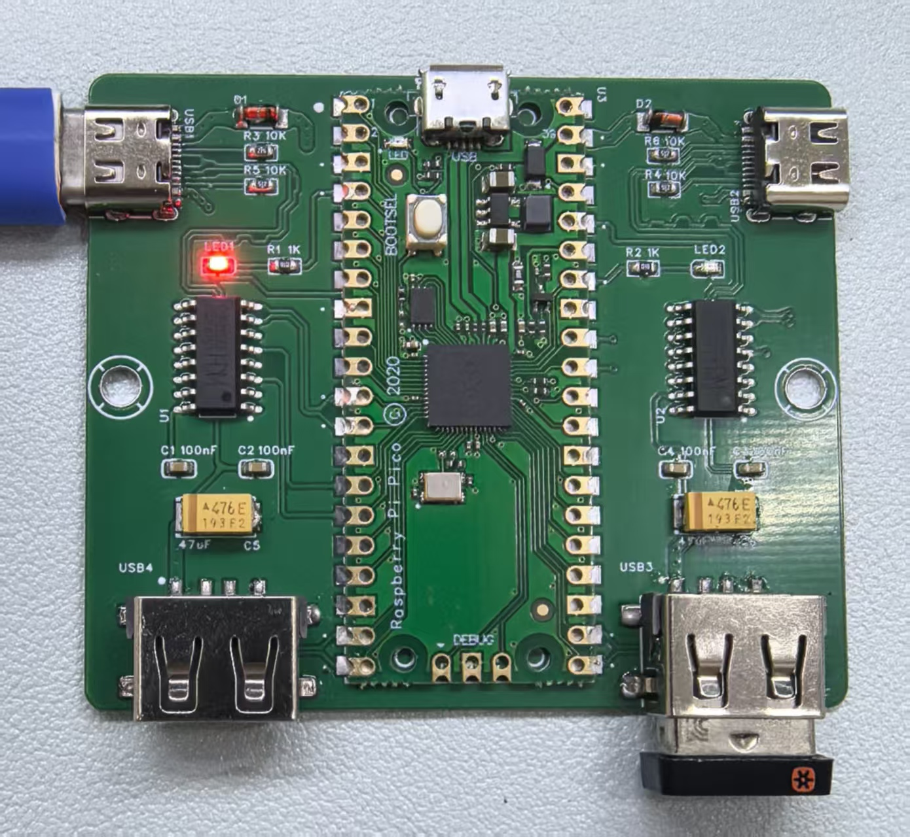
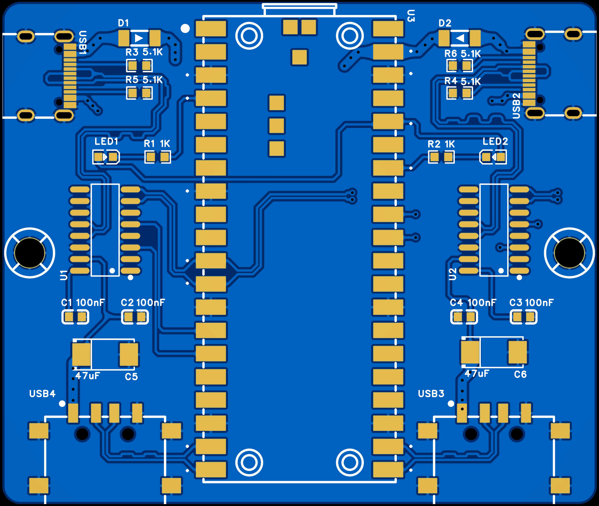
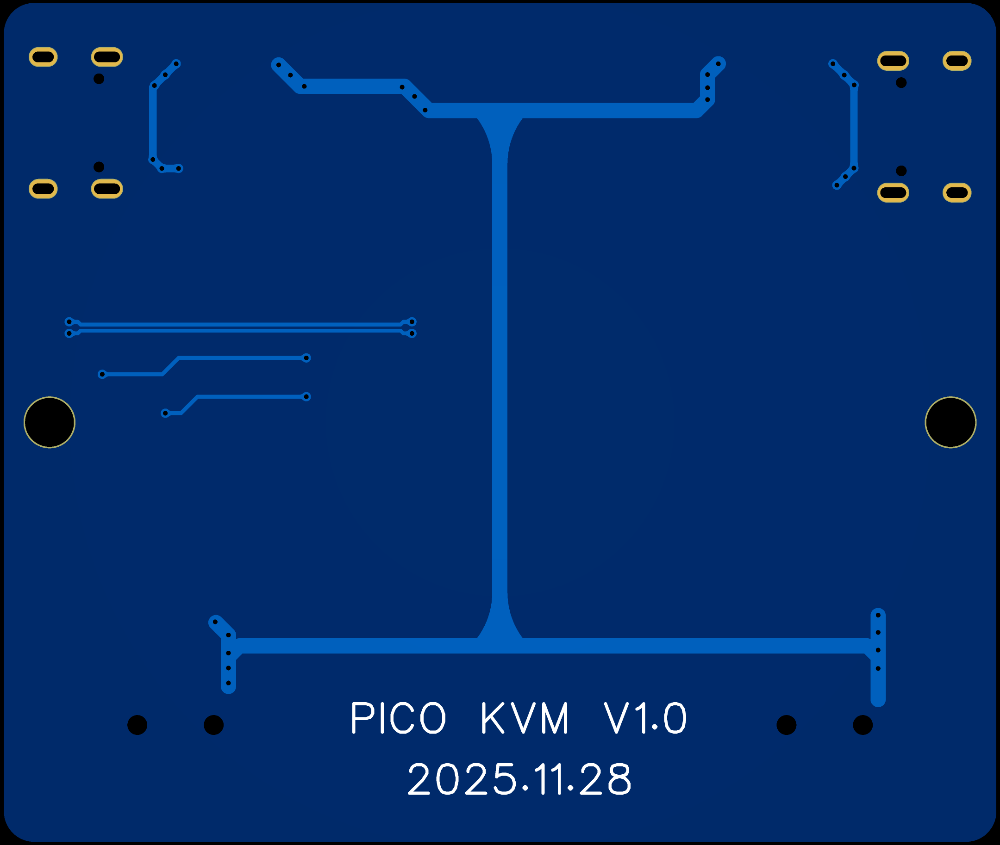

# A simple KVM with Pico and 2xCH9329

A simple KVM with Pico and 2xCH9329 chips which offers auto switch screens by moving mouse.
Something like deskhop[https://github.com/hrvach/deskhop]

## Hardware

* 1x Pico(RP2040)
* 2x CH9329
* 2x USB Type A Port
* 2x USB Type C Port
* 2x LEDs

# What I made

# Schemtic

# PCB

## IDE Tools options required

* Use PlatformIO
* Set "CPU Speed" to 120MHz.
